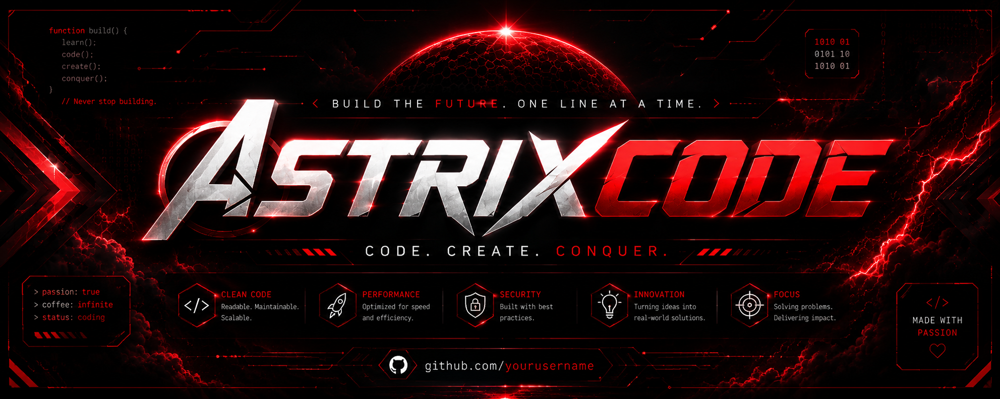

<p align="center">
  
</p>

<h1 align="center">🌌 ASTRIX</h1>
<p align="center">
  <strong>A sleek, modular, high-performance Discord framework powered by discord.js v14 & Node.js.</strong>
</p>

<p align="center">
  
  
  
</p>

---

## 🚀 Features

- <:rshield:1528681364340080713> **Secure Secret Management**: Built-in support for loading credentials from `.env` files natively using Node.js's built-in `process.loadEnvFile()`, keeping API keys and bot tokens safe.
- 📦 **Modular Handler Architecture**: De-cluttered folder structure separates message-based commands, slash commands, and event listeners.
- ⚡ **Advanced Diagnostics**: A custom ANSI-formatted `ping` command rendering dynamic multi-color diagnostic indicators (Websocket, HTTP response latency, and system specifications) inside Discord components.
- <:website:1528304906400960582> **State-of-the-Art Core**: Clean initialization using an extended client class (`CustomClient`) for centralized utility properties and method loading.

---

## 📂 Project Architecture

```txt
Astrix/
├── .env                  # Secure environment variables (Tokens, configs)
├── package.json          # Project configurations and dependencies
└── src/
    ├── index.js          # Core entry point of the application
    ├── assets/           # Graphical assets and background templates
    ├── commands/         # Standard message-based command files (prefix)
    ├── slashcommands/    # Interactive Slash commands deployment
    └── lib/
        ├── config.json   # Static configurations (prefix, developer IDs)
        └── functions/    # Custom Client initialization & loaders
```

---

## <:RedGear:1528691918727282760> Configuration & Setup

### 1. Requirements

Ensure you have the following installed on your machine:

- [Node.js](https://nodejs.org/) v20.6.0 or higher.
- A Discord Bot token from the [Discord Developer Portal](https://discord.com/developers/applications).

### 2. Environment Setup

Create a `.env` file in the root directory and define the following variables:

```env
LOG_LEVEL=INFO
DISCORD_TOKEN=YOUR_BOT_TOKEN_HERE
```

### 3. Installation

Clone the repository and install dependencies:

```bash
npm install
```

### 4. Running the Bot

Launch the bot instance:

```bash
node .
```

---

## 🛠️ Commands Showcase

### 1. Ping / Latency Command

Run system diagnostics of the bot network status.

- **Slash Command**: `/ping`
- **Message Command**: `.ping` or `.latency`

#### 📡 Real-time Diagnostic Output:

The command generates an aesthetic ANSI-colorized information list inside a Discord components container. It dynamically color-codes each metric based on latency severity:

- <:online:1528327584520081519> **Green** (`Excellent`): Latency `< 80ms`.
- 🔵 **Blue** (`Good`): Latency `80ms - 150ms`.
- 🟡 **Yellow** (`Average`): Latency `150ms - 250ms`.
- <:red_circle:1530092627528257647> **Red** (`Poor`): Latency `> 250ms`.

```txt
•  System Diagnostics      ::
   L  Status            :  Excellent
   L  Websocket         :  17ms
   L  Response          :  131ms
   L  Usage             :  22.10 MB
   L  Engine            :  Astrix Core v2.0.0
   L  Signal            :  ██████████
```

### 2. Avatar Command

Retrieve and display the avatar profile image of any target guild member or yourself.

- **Slash Command**: `/avatar`

---

## <:list:1528313871889334382> Custom Client Implementation

Here is how the bot initializes the `CustomClient` natively, resolving token credentials securely:

```javascript
try {
  process.loadEnvFile();
} catch (_) {}

const { developerIds } = require("../config.json");
const { Client, Collection, version } = require("discord.js");

module.exports.CustomClient = class CustomClient extends Client {
  messageCommands = new Collection();
  slashCommands = new Collection();
  developer = developerIds;

  start() {
    console.log(
      `◌ discord.js ${version} | ◌ NodeJs ${process.versions.node} ── version*`,
    );
    let token = process.env.DISCORD_TOKEN;
    if (!token) {
      console.error(
        "CRITICAL ERROR: DISCORD_TOKEN environment variable is not defined.",
      );
      process.exit(1);
    }
    // Clean string quotes wrapper if present
    if (
      (token.startsWith('"') && token.endsWith('"')) ||
      (token.startsWith("'") && token.endsWith("'"))
    ) {
      token = token.slice(1, -1);
    }
    this.login(token);
  }
};
```

---

<p align="center">
  Powered by <strong>ASTRIXCODE™</strong> • © 2026 ASTRIXCODE. All rights reserved.
</p>
